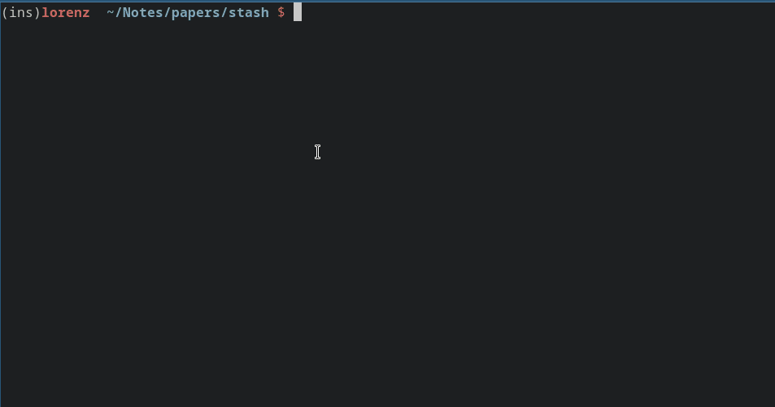
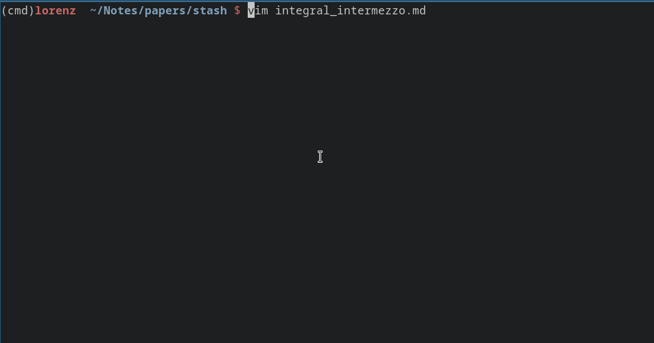
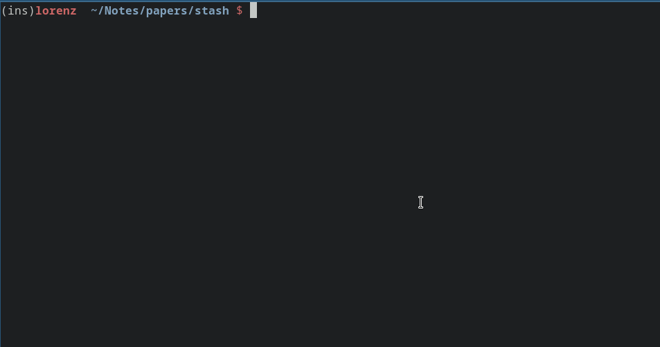

# Preview pictures in terminals with SIXEL graphics

Adds the ability to display block equations with SIXEL. You can find supported terminals [here](https://github.com/libsixel/libsixel/blob/master/md/Supported%20terminals.md).







## Features

 - [x] Render LaTex equations within math fences
 - [x] Display pictures in standalone image links
 - [ ] Support GnuPlot, arbitrary LaTex, fetch source from other files

## Installation

The installation is a bit more involved. You have to make sure that your terminal is able to render SIXEL characters. The plugin is written in Rust for performance reasons, and interfaced to Vimscript with [libcallex-vim](https://github.com/mattn/libcallex-vim). For this you also need to install toolchains for Rust and C. Imagemagick is also required to convert between different graphic formats and SIXEL.

First use a terminal supporting SIXEL characters

 * Tested: Alacritty ([PR #4763](https://github.com/alacritty/alacritty/pull/4763) or merged in this [fork](https://github.com/microo8/alacritty-sixel)) 
 * Not tested: XTerm, [others](https://saitoha.github.io/libsixel/)

You have to install imagemagick to render graphics to SIXEL format:

 * Archlinux: `pacman -S imagemagick`
 * Ubuntu: package `libmagickwand` too old, see `https://github.com/SoftCreatR/imei`
 * Other: https://imagemagick.org/script/download.php

Before installing the vim plugin, make sure that toolchains for Rust and C are installed:

 * for C install `make` and `gcc`
 * for Rust install a stable toolchain, for example with [rustup](https://rustup.rs/)

Finally add the following section to your vim configuration
```
Plug 'mattn/libcallex-vim', { 'do': 'make -C autoload' }
Plug 'bytesnake/vim-inline-view', { 'do': 'cargo build --release' }
```

and install with `source %|PlugInstall`.

The plugin is currently not mapped to a file format, but can be manually enabled by setting the `filetype` variable to `graphical-preview` or add the follow preamble to your file:

```vim
vim : set filetype=markdown.graphical-preview :
```

## FAQ

 > 
