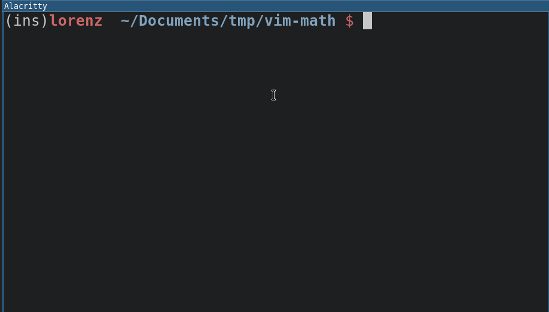

# Preview LaTex equation with SIXEL

Adds the ability to display block equations with SIXEL. You can see supported terminals [here](https://github.com/libsixel/libsixel/blob/master/md/Supported%20terminals.md).

WIP
